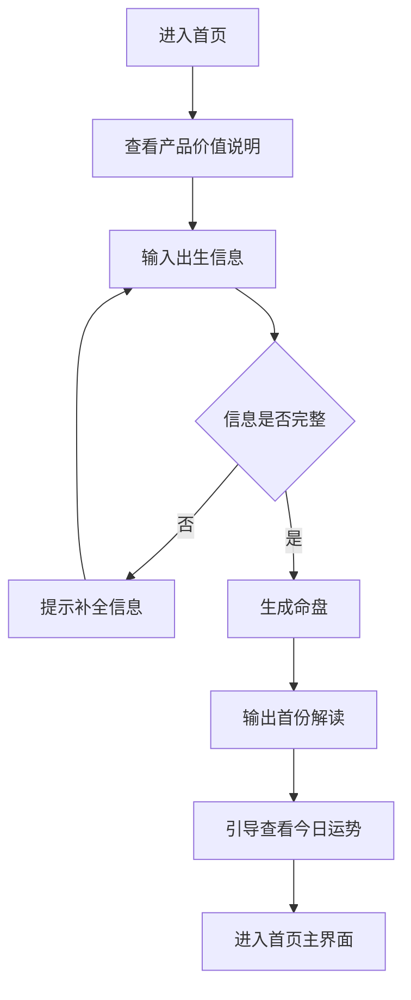
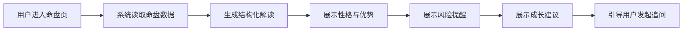
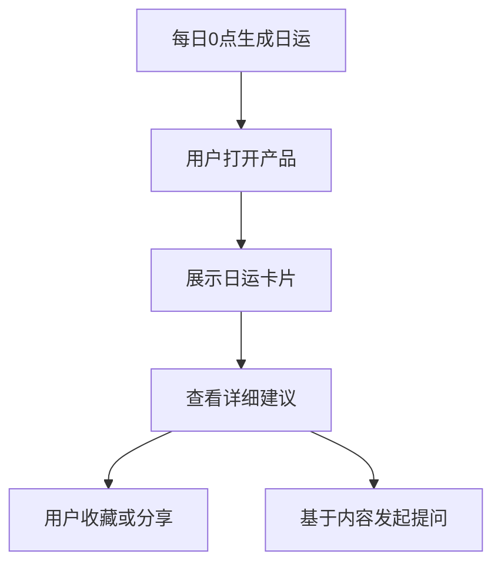
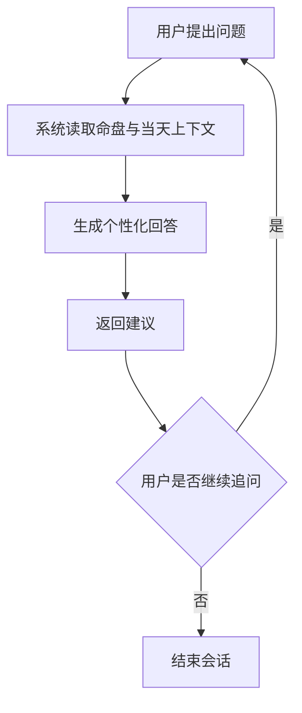
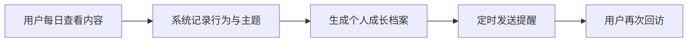

# AI八字算命助手 PRD

## 1. 文档信息

| 版本号 | 创建日期 | 负责人 | 状态 |
|--------|----------|--------|------|
| V1.1 | 2026-04-15 | 待补充 | 详细版初稿 |

## 2. 修订历史

| 版本 | 修订内容 | 修订时间 | 修订人 |
|------|----------|----------|--------|
| V1.1 | 补充详细版PRD：量化指标、版本规划、埋点方案与技术约束 | 2026-04-15 | Claude |
| V1.0 | 创建 AI八字算命助手首版PRD | 2026-04-15 | Claude |

## 3. 名词解释

| 术语 | 解释 |
|------|------|
| 八字 | 基于出生时间推演的传统命理分析体系，通常由年、月、日、时四柱组成。 |
| 命盘 | 根据用户出生信息生成的八字结构化结果。 |
| 运势解读 | 基于命盘与时间维度输出的趋势、提醒、建议内容。 |
| AI解读 | 使用大模型将命理规则与自然语言表达结合，生成更易理解的说明与建议。 |
| 日签/日运 | 面向用户的日级别运势摘要、宜忌提示与行动建议。 |

## 4. 产品概述

### 4.1 产品背景

#### 市场现状
近年来，泛心理、泛玄学、轻咨询类产品持续受到年轻用户与职场用户关注。一方面，用户面对工作压力、成长焦虑与决策不确定性时，希望获得低门槛、随时可得的陪伴式建议；另一方面，传统命理服务存在信息不透明、表达晦涩、咨询门槛高、体验不连续等问题，难以满足移动互联网时代对即时反馈和持续互动的需求。

AI能力的成熟，使“复杂规则 + 个性化表达 + 高频互动”的产品模式成为可能。八字类内容天然具备“个体化、可解释、可持续消费”的特点，若以 AI 对传统命理结果进行结构化拆解和自然语言包装，可以显著降低理解门槛，并将一次性咨询体验升级为持续陪伴型产品。

#### 问题与机会
当前用户获取八字解读的方式主要有三类：
1. 在社交平台上浏览碎片化内容，娱乐性强但可信度弱；
2. 寻找人工命理师进行咨询，成本高且质量波动大；
3. 使用传统命盘网站或小程序，输出内容专业但可读性差。

机会点在于：打造一款面向日常陪伴场景的 AI八字助手，将“命盘生成、个性化解释、每日运势、成长建议”整合为连续体验，满足用户对自我认知与日常提醒的双重需求，并通过日更内容驱动留存。

#### 为什么是现在
- 用户对 AI陪伴、AI解读、AI问答的接受度已明显提高；
- 情绪价值类产品与轻咨询类产品的付费教育已经形成；
- 日常运势与自我认知具备天然高频打开场景，适合通过消息提醒和连续打卡提升留存；
- 传统命理内容可通过结构化输出和现代语言重写实现“更易懂、更可互动”的产品体验。

#### 我们的优势
- AI 能够将传统术语翻译为产品经理等高认知用户可快速理解的现代语言；
- 可结合用户长期互动记录，形成连续、个性化的解读与建议；
- 产品形态灵活，可从轻量娱乐陪伴切入，再逐步扩展到深度报告、专题分析与会员服务。

### 4.2 产品目标

#### 业务目标
1. 打造一款具备持续打开理由的 AI命理陪伴产品，以日常运势和自我认知内容提升用户留存。
2. 建立“首次生成命盘 -> 首次获得有效反馈 -> 形成连续查看习惯”的核心转化链路。
3. 验证 AI + 命理内容在高频互动产品中的可行性，为后续会员订阅、深度报告等商业化打基础。

#### 用户目标
1. 低门槛获取专属八字命盘与个性化解读；
2. 每天快速获得可读、可感知、可执行的运势提醒；
3. 在职业压力与成长焦虑之外，获得关于性格、状态和节奏的自我认知参考；
4. 获得比传统命盘工具更易懂、比碎片化内容更个性化的体验。

#### 北极星指标
- 7日留存率

#### 首版量化目标（MVP阶段）
- 新用户命盘创建完成率 >= 70%
- 首次建档后查看首份解读完成率 >= 85%
- 首日查看日运比例 >= 60%
- D1留存率 >= 35%
- D7留存率 >= 15%
- AI问答渗透率 >= 25%
- 消息提醒开启率 >= 40%
- 连续3天访问用户占比 >= 20%

#### 核心过程指标
- 命盘创建完成率
- 首日二次访问率
- 日运内容查看率
- 连续7天打开占比
- AI问答互动率
- 日运消息提醒点击率
- 命盘结果页跳转到日运页转化率
- 日运详情页发起提问转化率
- 提醒开启后次日回访率

### 4.3 目标用户

#### 核心目标用户
**产品经理**，尤其是对个人状态管理、成长方向、工作节奏和自我认知有持续关注的人群。

#### 用户画像
1. **成长焦虑型产品经理**
   - 年龄 23-35 岁
   - 关注职业成长、晋升、岗位变化、自我能力定位
   - 工作节奏快，长期处于信息过载和多任务切换状态
   - 愿意尝试心理测试、MBTI、星座、运势等轻量自我探索工具

2. **高压决策型产品经理**
   - 经常面对需求优先级、跨团队协调、目标压力
   - 希望借助外部视角缓解决策疲劳，获得“今天适合推进什么、回避什么”的提醒
   - 不一定完全相信命理，但接受其作为一种低成本自我映射工具

3. **内容消费型产品经理**
   - 对结构化、信息密度高、表达清晰的内容有明显偏好
   - 对传统玄学表达耐受度低，更喜欢现代语言、标签化总结和 actionable 建议

#### 用户特征总结
- 理性与感性并存：既追求解释逻辑，也愿意消费情绪价值；
- 对内容质量较敏感：不接受空泛、模板化、过度神化的表达；
- 对产品体验要求较高：希望输入成本低、输出结构清晰、结论可快速获取。

### 4.4 用户痛点

本模块为本PRD的重点完善内容。

#### 痛点一：高压工作下，用户需要一个低成本的“自我状态参照系”
产品经理长期面对需求变化、排期压力、跨部门博弈与结果不确定性，日常状态容易受到外部环境影响。很多用户并不是要“被算命决定人生”，而是希望在高压节奏中找到一个简单、轻量、可随手查看的状态参照。

**具体表现：**
- 早上开始工作前，会想知道今天更适合推进沟通、独立思考还是处理杂事；
- 在连轴会议、项目冲刺和多线程任务中，希望有人帮自己“做一个情绪和节奏提醒”；
- 对“今天是否适合做关键表达/推动关键事项”有天然兴趣，但现有工具无法提供个体化参照。

**现有方案问题：**
- To-do、日历、番茄钟等效率工具解决的是任务管理，不解决心理预期与状态感知；
- 星座/运势内容太泛，缺乏个体专属感；
- 人工命理咨询频次低、成本高，无法覆盖日常使用场景。

**机会判断：**
AI八字助手可以提供“每日专属状态提醒 + 宜忌建议 + 心理预期管理”，作为一种轻量陪伴工具切入，而不是替代真实决策。

#### 痛点二：用户对自我认知有持续需求，但传统命理内容难懂、难用、难转化为行动
产品经理天然重视认知升级，希望理解自己的优势、短板、沟通风格和成长风险点。但传统八字产品通常输出大量术语、判断结论和抽象表述，让用户难以把内容转化为现实理解。

**具体表现：**
- 用户希望理解“我更适合什么样的工作节奏、合作方式和成长路径”；
- 用户对“为什么总是在某类冲突或瓶颈里反复出现问题”有强烈兴趣；
- 用户希望内容能够与现代职场语境连接，如表达风格、推动力、抗压方式、长期成长建议。

**现有方案问题：**
- 传统命盘工具强调专业术语，如五行旺衰、十神格局，但普通用户难以理解；
- 内容更像结论堆砌，缺少清晰结构与解释逻辑；
- 缺少“你可以怎么做”的落地建议，阅读后难以形成持续价值感。

**机会判断：**
通过 AI 将命理信息翻译成结构化的现代语言，例如“你的优势能力”“高压场景下的典型反应”“更适合的行动策略”，能显著提升可读性和复用率。

#### 痛点三：碎片化内容很多，但真正“专属且持续”的陪伴型体验很少
产品经理是重度信息消费者，已经接触过大量 MBTI、星座、职业测评、情绪内容。问题不在于内容匮乏，而在于大多数内容泛化严重、相似度高、无法形成长期陪伴价值。

**具体表现：**
- 用户刷到大量“今日运势/性格分析”内容，但很快遗忘；
- 大多数内容不基于个人出生信息，缺少专属感；
- 即便做过测评，也通常是一次性结果，缺少持续更新与动态提醒。

**现有方案问题：**
- 内容平台偏传播导向，不偏服务导向；
- 传统算命服务偏一次性咨询，不偏长期关系经营；
- 用户难以形成每天回来看的理由。

**机会判断：**
以“命盘是底层、日运是触点、AI对话是互动、成长档案是沉淀”的产品结构，可把一次性好奇心转化为连续留存。

#### 痛点四：用户愿意接受启发，但排斥被“玄而不实”地说教
目标用户是产品经理，通常具备较强的信息辨别能力。用户愿意把命理当作一种参考视角，但不愿接受完全黑箱、绝对化、不可解释的表达方式。

**具体表现：**
- 用户对“注定”“必须”“绝对不适合”等表达敏感；
- 更偏好“倾向、提醒、建议、观察维度”这样的表达；
- 希望产品说明结果来源，至少知道结论是如何组织出来的。

**现有方案问题：**
- 不少命理产品依赖夸张话术吸引点击，可信度不足；
- 缺少结果解释层和语气控制，容易引发用户反感；
- 如果输出过于模板化，会迅速失去复访动力。

**机会判断：**
产品需要建立“可信但不过度承诺”的内容风格：以个性化、结构化、可解释为核心，用陪伴与启发替代神化与恐吓。

#### 痛点五：用户希望获得即时反馈，但不愿投入复杂输入成本
如果用户首次使用需要理解复杂概念、填写大量信息或等待很久，流失风险极高。尤其对于娱乐陪伴型产品，第一体验必须足够轻。

**具体表现：**
- 用户愿意输入出生年月日时，但不愿处理复杂命理字段；
- 用户希望尽快看到结果，而不是被冗长流程打断；
- 用户对于首次体验是否“有惊喜感”非常敏感。

**现有方案问题：**
- 传统命理站点输入项复杂，移动端体验差；
- 输出页面信息量大但重点不突出；
- 缺少首屏即价值感，用户不知道下一步该做什么。

**机会判断：**
需要把首版体验设计成“1分钟建档 -> 立即获得一份看得懂的专属解读 -> 引导查看今日运势与继续提问”，确保用户快速感知产品价值。

#### 痛点优先级排序

| 优先级 | 痛点 | 影响留存程度 | 首版解决方式 |
|--------|------|--------------|--------------|
| P0 | 缺少低成本状态参照系 | 高 | 提供每日运势、宜忌、节奏建议 |
| P0 | 碎片化内容缺乏专属和持续性 | 高 | 建立命盘 + 日运 + 对话连续体验 |
| P1 | 自我认知需求强但内容难懂 | 高 | 用现代职场语言输出结构化解读 |
| P1 | 排斥玄而不实的表达 | 中高 | 建立可信、克制、可解释的话术体系 |
| P2 | 首次输入成本敏感 | 中高 | 简化建档流程与结果展示路径 |

### 4.5 主要功能

#### 功能1：八字建档与命盘生成
用户输入出生年月日、时辰、性别等必要信息，系统自动生成命盘，并输出可读化基础信息。

#### 功能2：AI命盘解读
基于命盘，生成结构化解读内容，包括性格特征、优势能力、注意事项、成长建议等。

#### 功能3：每日运势
每日生成专属日运内容，包括整体状态、宜做事项、谨慎事项、关键词和一句话提醒。

#### 功能4：AI追问互动
用户可围绕日运或命盘发起追问，例如“今天适合汇报吗”“我适合带团队还是做独立项目”“为什么我总在沟通上内耗”等。

#### 功能5：成长档案
沉淀用户历史运势、关注主题、问答记录与阶段性总结，形成长期陪伴感。

#### 功能6：提醒与连续签到
支持每日提醒查看运势、连续签到、阶段总结，形成固定复访习惯。

### 4.6 竞品分析

> 当前版本基于产品方向做轻量级竞品归纳，后续建议补充真实竞品调研与截图证据。

| 竞品类型 | 代表形态 | 优势 | 劣势 | 对我们的启示 |
|----------|----------|------|------|--------------|
| 泛星座/运势内容产品 | 星座运势号、运势小程序 | 轻量、高频、传播性强 | 个性化弱、同质化严重 | 日运内容要足够轻，且必须强化“专属感” |
| 传统命盘工具 | 命盘网站、八字排盘工具 | 专业度高、结果完整 | 难懂、交互差、持续性弱 | 专业结果要保留，但表达要翻译成现代语言 |
| 人工命理咨询 | 线上咨询/直播连麦 | 情绪价值高、个性化强 | 成本高、不可持续、质量不稳定 | AI要补足陪伴频次，后续可延展人机结合服务 |
| 泛心理/自我认知工具 | MBTI、人格测试、成长类App | 易传播、可解释、结构清晰 | 个体专属性有限、动态性不足 | 自我认知模块需足够结构化，降低玄学门槛 |

#### 我们的差异化方向
1. **从“看命”转向“陪伴式状态管理”**：强调日常可用，而非一次性消费；
2. **从“专业术语”转向“现代语言解释”**：面向产品经理等内容敏感用户；
3. **从“泛化运势”转向“专属命盘驱动内容”**：建立个体化记忆点；
4. **从“结果输出”转向“可追问、可沉淀、可连续回访”**：服务留存目标。

### 4.7 产品策略与价值主张

#### 核心价值主张
为高压工作中的产品经理提供一个“低门槛、可持续、够专属”的 AI八字陪伴工具。产品不提供替代现实决策的确定性答案，而是提供每日节奏提醒、自我认知镜像与可追问的启发式建议。

#### 用户价值
1. 看得懂：把传统命理翻译成现代职场语言；
2. 用得上：输出可转化为当日行动参考；
3. 愿意回来：通过日运、提醒与成长档案建立持续打开理由。

#### 商业价值
1. 通过高频日运场景建立稳定留存基础；
2. 通过 AI互动提升内容消费深度与使用时长；
3. 为后续会员订阅、专题报告和高级服务验证需求。

#### 产品定位边界
- 定位：娱乐陪伴 + 自我探索工具；
- 非定位：严肃人生决策工具、医疗/法律/投资建议工具；
- 表达原则：启发式、陪伴式、非宿命论、非恐吓式。

## 5. 功能需求

### 5.1 功能一：八字建档与首份解读

#### 功能概述
用户首次进入产品后，完成出生信息输入并生成个人命盘，系统立即返回一份简洁、结构化、可读的首份解读。

#### 用户场景
**场景1：首次尝试产品**
- **用户**：25岁产品经理
- **背景**：在社交平台看到产品介绍，对“AI八字解读”感到好奇
- **目标**：快速知道这个产品是否值得持续使用
- **行为**：
  1. 进入产品首页
  2. 输入出生日期、出生时间、性别
  3. 点击生成命盘
  4. 阅读首份解读
- **结果**：快速感知专属感与内容价值，愿意继续查看今日运势
- **痛点**：担心输入麻烦、内容看不懂、结果太模板化

#### 功能流程

#### 前置条件
- 用户未创建过命盘；
- 系统已具备基础命盘计算能力与内容生成模板。

#### 后置条件
- 用户账号绑定一份命盘；
- 生成首份解读结果；
- 记录首次建档完成事件。

#### 异常场景

| 异常情况 | 触发条件 | 处理方式 | 用户提示 |
|----------|----------|----------|----------|
| 出生时间缺失 | 用户无法提供具体时辰 | 提供“未知时辰”选项并说明精度影响 | 未提供出生时辰会影响部分解读准确度 |
| 输入格式错误 | 日期或时间非法 | 阻止提交并高亮错误项 | 请检查出生日期与时间格式 |
| 生成失败 | 服务异常 | 重试并保留输入内容 | 当前生成失败，请稍后再试 |

### 5.2 功能二：AI命盘解读

#### 功能概述
围绕用户命盘，生成结构化的长期解读，包括性格特点、优势能力、风险提醒、成长方向与职场风格建议。

#### 用户场景
**场景1：理解自己适合什么样的工作方式**
- **用户**：在职业发展期的产品经理
- **背景**：对自己是更适合强推进型还是深思型工作方式感到困惑
- **目标**：通过解读获得一套可参考的自我认知框架
- **行为**：查看 AI命盘解读模块
- **结果**：获得清晰、现代语言表达的个人画像
- **痛点**：不想看晦涩术语，希望直接理解重点

#### 功能流程

#### 前置条件
- 用户已生成命盘。

#### 后置条件
- 解读结果被展示并缓存；
- 用户可继续进入互动问答。

#### 异常场景

| 异常情况 | 触发条件 | 处理方式 | 用户提示 |
|----------|----------|----------|----------|
| 内容过于模板化 | 多用户输出相似 | 加强个性化变量与命盘映射策略 | 已为你重新生成更个性化的解读 |
| 术语过多 | 规则层输出未被充分翻译 | 增加“白话解释”层 | 可切换查看专业版/白话版 |

### 5.3 功能三：每日运势

#### 功能概述
系统每日生成用户专属运势卡片，包含状态评分、今日关键词、宜做事项、谨慎事项与行动建议。

#### 用户场景
**场景1：上班前快速看一眼今日状态**
- **用户**：通勤中的产品经理
- **背景**：准备开始一天工作，希望快速获得节奏提醒
- **目标**：用 30 秒看完并形成心理预期
- **行为**：打开 App/小程序查看今日运势
- **结果**：知道今天适合推进什么、避免什么
- **痛点**：没有足够时间看长文，内容必须短平快

#### 功能流程

#### 前置条件
- 用户已完成命盘创建；
- 当日日运数据已生成。

#### 后置条件
- 记录日运曝光和点击；
- 支持进入追问互动。

#### 异常场景

| 异常情况 | 触发条件 | 处理方式 | 用户提示 |
|----------|----------|----------|----------|
| 当日内容未生成 | 定时任务异常 | 兜底展示最近一次运势并提示刷新 | 今日运势稍晚到达，请稍后刷新 |
| 文案过长 | 生成内容超出卡片范围 | 自动压缩摘要，详情页展开查看 | 已为你收起详细说明 |

### 5.4 功能四：AI追问互动

#### 功能概述
用户可对命盘解读或日运内容发起追问，系统结合用户档案和上下文返回更贴近个人场景的解答。

#### 用户场景
**场景1：围绕当天工作安排进行提问**
- **用户**：即将向上级汇报的产品经理
- **背景**：看到今日运势提示“适合整理思路，不宜强推动”
- **目标**：判断今天是否适合做关键汇报
- **行为**：输入“我今天适合做需求汇报吗？”
- **结果**：获得更具体、语气克制的建议
- **痛点**：希望得到贴近现实的说法，而不是空泛套话

#### 功能流程

#### 前置条件
- 用户已建档；
- 用户进入命盘页或日运页。

#### 后置条件
- 保存会话记录；
- 提炼用户关注主题，用于后续推荐。

#### 异常场景

| 异常情况 | 触发条件 | 处理方式 | 用户提示 |
|----------|----------|----------|----------|
| 问题超出产品边界 | 涉及医疗、法律、投资等高风险建议 | 进行边界提示并拒绝确定性结论 | 该问题超出当前能力范围，请结合专业意见判断 |
| 回答过度绝对化 | 模型生成高风险措辞 | 进行语气校正与安全重写 | 以下内容仅供参考，请结合实际情况判断 |

### 5.5 功能五：成长档案与连续提醒

#### 功能概述
通过历史记录、连续签到与消息提醒，强化“持续陪伴”的产品感知，并帮助用户回顾阶段性状态变化。

#### 用户场景
**场景1：一周后回看自己的状态趋势**
- **用户**：持续使用一周的产品经理
- **背景**：想知道自己最近关注了哪些主题
- **目标**：看到连续使用带来的积累感
- **行为**：进入成长档案页面
- **结果**：看到历史日运、提问记录、阶段关键词
- **痛点**：若产品缺少沉淀，就会被视为一次性娱乐工具

#### 功能流程

#### 前置条件
- 用户已有多次访问记录；
- 已开启提醒权限（如适用）。

#### 后置条件
- 用户形成连续访问路径；
- 系统可产出周度摘要。

#### 异常场景

| 异常情况 | 触发条件 | 处理方式 | 用户提示 |
|----------|----------|----------|----------|
| 提醒打扰感强 | 频率过高或时间不合适 | 提供提醒频次配置 | 你可以在设置中调整提醒时间 |
| 沉淀内容价值低 | 仅做简单历史堆叠 | 增加周总结与主题归纳 | 已为你生成本周状态回顾 |

### 5.6 非功能需求

#### 性能需求
1. 首次命盘生成页面响应时间不超过 5 秒；
2. 每日运势卡片首屏加载时间不超过 2 秒；
3. AI问答首字响应时间不超过 3 秒；
4. 日运生成任务成功率不低于 99%；
5. 核心页面崩溃率低于 0.5%。

#### 内容质量要求
1. 输出语气需克制、温和、避免绝对化表达；
2. 自我认知与日运内容需保持个体化差异；
3. 核心内容需支持“白话解释”，降低术语理解门槛；
4. 严禁输出恐吓、宿命论、强结论式内容。

#### 安全与合规要求
1. 明示产品为娱乐陪伴与自我探索工具，不替代专业意见；
2. 对医疗、法律、投资等高风险领域设置内容边界；
3. 用户出生信息属于敏感个人信息，应加密存储并最小化使用；
4. 支持用户删除个人数据与历史记录。

#### 算法与策略指标
1. 命盘生成准确率：基础排盘规则正确率 100%；
2. 日运内容个性化命中率：需通过用户主观问卷与复访行为间接验证；
3. AI回答满意度：首版目标 >= 80% 正向反馈；
4. 模板重复率：控制高频模板化输出比例，避免连续多日内容相似。

#### 技术实现约束
1. 前端基于 uni-app + Vue 3 + TypeScript 实现，优先保证 H5 / 小程序端一致体验；
2. 后端基于 FastAPI 提供命盘生成、日运分发、AI问答与用户数据服务；
3. 数据层使用 SQLAlchemy + MySQL 管理用户档案、日运记录、问答记录与埋点事件；
4. 所有输入校验通过 Pydantic 统一处理，确保出生信息和用户请求格式合法；
5. 日运生成、消息提醒与周报汇总需预留异步任务能力，避免阻塞主链路。

## 6. MVP范围与优先级

### MVP必须包含
- 八字建档
- 首份命盘解读
- 每日运势卡片
- AI追问互动
- 每日提醒

### MVP暂不包含
- 多人合盘
- 深度年度报告
- 付费咨询撮合
- 社区内容广场
- 多命理体系扩展（如紫微、塔罗）

## 7. 版本规划

### V1.0 MVP
目标：验证“命盘建档 + 日运 + AI追问”是否能建立稳定留存。

包含内容：
- 八字建档
- 首份命盘解读
- 每日运势卡片
- AI追问互动
- 每日提醒
- 基础成长档案

成功标志：
- D7留存达到目标值
- 用户形成稳定日运查看习惯
- AI问答带来明显互动提升

### V1.1 留存增强版
目标：增强持续使用理由，提升连续访问与内容沉淀感。

计划功能：
- 周运/周总结
- 用户关注主题标签归纳
- 更丰富的成长档案展示
- 日运分享卡片
- 提醒频次与时段个性化配置

### V1.2 商业化验证版
目标：探索付费转化与高价值内容供给能力。

计划功能：
- 深度专题报告
- 会员订阅体系
- 高级问答次数包或权益包
- 节点型专题内容（如求职期、晋升期、转岗期）

## 8. 埋点与数据监测方案

### 核心漏斗
1. 进入首页
2. 点击开始建档
3. 完成出生信息填写
4. 成功生成命盘
5. 查看首份解读
6. 查看今日运势
7. 发起首次AI提问
8. 开启提醒
9. 次日回访

### 关键埋点事件

| 事件名 | 触发时机 | 关键属性 |
|--------|----------|----------|
| view_home | 用户进入首页 | 渠道、设备、时间段 |
| click_start_profile | 点击开始建档 | 渠道、页面来源 |
| submit_birth_info | 提交出生信息 | 是否填写时辰、性别、耗时 |
| profile_created | 命盘创建成功 | 创建耗时、是否一次成功 |
| view_profile_result | 查看首份解读 | 停留时长、模块浏览深度 |
| click_daily_fortune | 进入日运页 | 来源页面、是否首次访问 |
| view_daily_fortune | 查看日运内容 | 是否查看详情、停留时长 |
| ask_ai_question | 发起AI提问 | 提问主题、来源模块、问题长度 |
| receive_ai_answer | AI回答返回 | 响应时长、是否追问 |
| enable_reminder | 开启提醒 | 提醒时间、提醒渠道 |
| revisit_next_day | 次日回访 | 回访来源、是否来自提醒 |
| share_result | 分享内容 | 分享类型、分享入口 |

### 重点分析看板
1. 新用户建档转化漏斗；
2. 建档后到日运查看的承接率；
3. 日运到 AI提问的互动转化；
4. 提醒开启与次日回访的关联；
5. 不同渠道用户的 D1 / D7 留存对比；
6. 高频主题分布，用于反推内容策略。

### A/B实验建议
1. **首屏价值文案实验**：测试“陪伴感文案”与“自我认知文案”对建档转化的影响；
2. **日运卡片样式实验**：测试短卡片 vs 详情型卡片对查看率和提问率的影响；
3. **提醒触达实验**：测试不同提醒时间对回访率的影响；
4. **首份解读结构实验**：测试“结论优先”与“解释优先”对用户停留时长的影响。

## 9. 验收标准

| 模块 | 验收标准 |
|------|----------|
| 八字建档 | 用户可在 1 分钟内完成建档并成功看到命盘结果 |
| 命盘解读 | 输出结构清晰，包含优势、风险、建议三类内容 |
| 每日运势 | 每日自动生成，用户打开即可看到专属内容 |
| AI追问 | 能基于当前上下文回答用户问题，避免绝对化措辞 |
| 提醒与连续访问 | 用户可配置提醒，并可查看历史记录 |

## 10. PRD Review清单

### 完整性检查
- [x] 产品背景清晰，说明了为什么做
- [x] 目标用户有明确画像
- [x] 用户痛点围绕产品经理场景展开
- [x] 主要功能覆盖首版核心路径
- [x] 功能需求包含流程、前后置与异常场景
- [x] 已补充量化指标、版本规划与埋点方案
- [ ] 待补充真实竞品调研证据与数据支撑

### 质量检查
- [x] 用户痛点有优先级排序
- [x] 内容风格避免模糊与绝对化表达
- [x] 留存目标与产品结构存在对应关系
- [x] 已补充更明确的数据目标与实验方案

### 可读性检查
- [x] 结构清晰，层级完整
- [x] 表格与流程图已补充
- [x] 术语已解释

## 11. 待补充信息

1. 负责人、业务归属与目标发布时间；
2. 目标平台形态（App / 小程序 / H5 / Web）；
3. 是否需要接入登录体系、消息推送与支付；
4. 是否计划在 MVP 阶段引入会员机制；
5. 真实竞品名单与调研结论；
6. 用户访谈或问卷数据，用于进一步增强“用户痛点”模块说服力。
